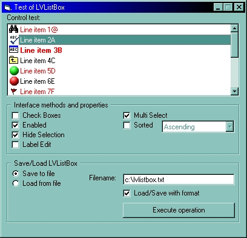



## LVListbox \- Listbox based in Listview

### Description

Emule a listbox control based into a listview control, support formatatio of item (like bold, forecolor, etc...) and support images.
 
### More Info
 

             |
---                |---
**Submitted On**   |2003-09-29 11:27:18
**By**             |[Mauricio Cunha](https://github.com/Planet-Source-Code/PSCIndex/blob/master/ByAuthor/mauricio-cunha.md)
**Level**          |Intermediate
**User Rating**    |5.0 (30 globes from 6 users)
**Compatibility**  |VB 5\.0, VB 6\.0, VBA MS Access, VBA MS Excel
**Category**       |[OLE/ COM/ DCOM/ Active\-X](https://github.com/Planet-Source-Code/PSCIndex/blob/master/ByCategory/ole-com-dcom-active-x__1-29.md)
**World**          |[Visual Basic](https://github.com/Planet-Source-Code/PSCIndex/blob/master/ByWorld/visual-basic.md)
**Archive File**   |[LVListbox\_1651869292003\.zip](https://github.com/Planet-Source-Code/mauricio-cunha-lvlistbox-listbox-based-in-listview__1-48885/archive/master.zip)

